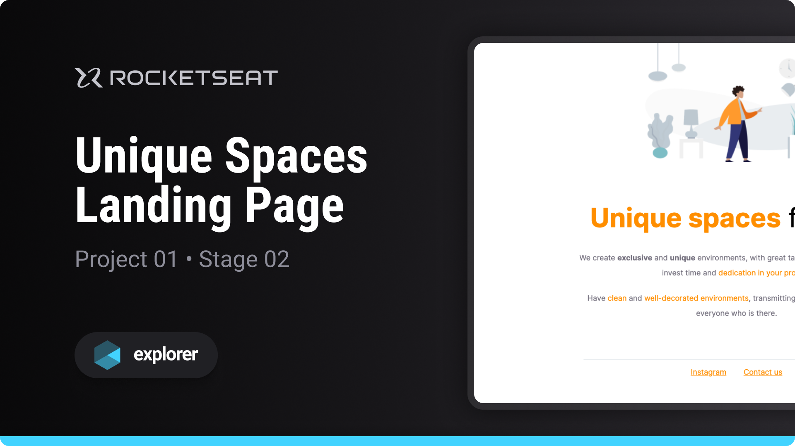

# Unique Spaces

Project developed on Rocketseat's Explorer course

**Unique Spaces is a landing page designed to learn basic web development concepts**

## 🔗 Project Links

- 🚀 [**Deploy**](https://emanueltavecia.github.io/unique-spaces)

## 📋 Project information

- Rocketseat Explorer
- Stage 02
- Project 01

## 🧠 Concepts learned

The development of this project aims to learn the following concepts:

- Basic structure of an HTML page
- Main HTML tags
- Basic CSS styling concepts
- Import custom fonts

## 💻 Technologies

## 📄 License

This project is licensed under the MIT License - see the [LICENSE](./LICENSE) file for more details.
